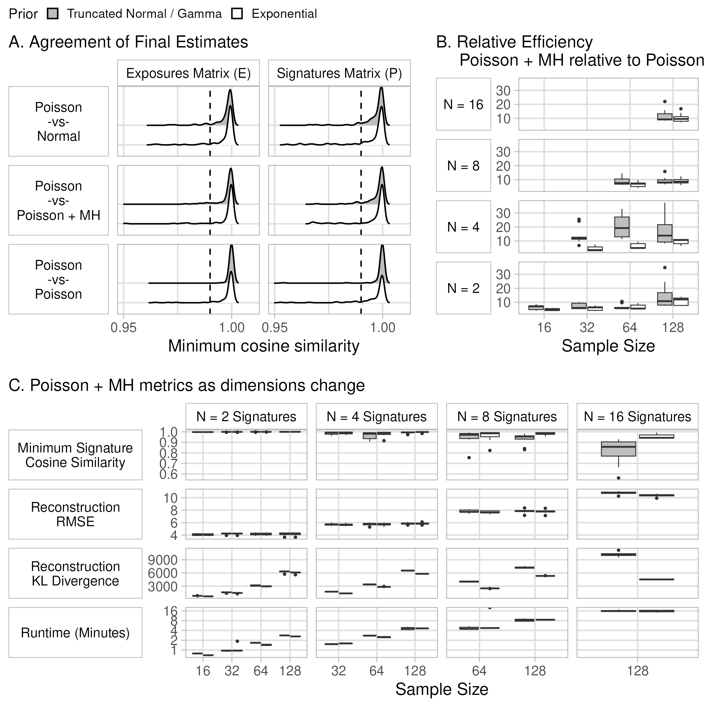
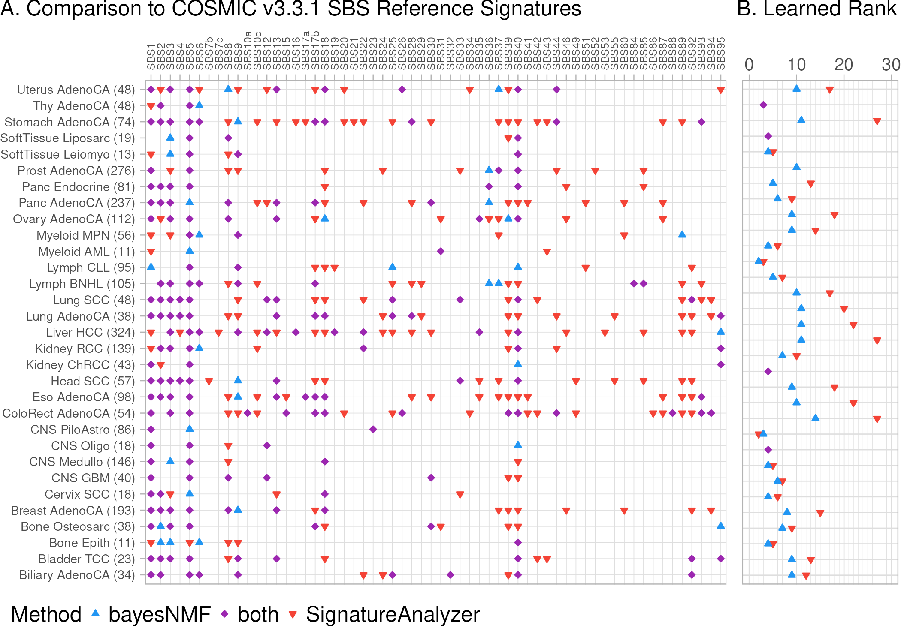

# bayesNMF: Fast Bayesian Poisson NMF with Automatically Learned Rank Applied to Mutational Signatures

This repository contains all code necessary to recreate all simulation studies and data application results presented in the paper ["bayesNMF: Fast Bayesian Poisson NMF with Automatically Learned Rank Applied to Mutational Signatures"](https://arxiv.org/abs/2502.18674). 

For the R package, see the [bayesNMF](https://github.com/jennalandy/bayesNMF) repository.

## Directory Structure
- `studies`: holds code to run all analyses (quarto notebooks, R scripts, and slurm job files, described in detail below)
- `data`: holds all raw simulated data
- `logs`: slurm job log files
- `output`: holds raw output from bayesNMF or SignatureAnalyzer
- `processed`: holds all processed data and processed output, incuding PCAWG mutational counts matrices matrices and simulation metrics
- `figures`: saved figures from all analyses

## Reproducible Analysis
All analyses must be run in a particular order: generating or processing data, running slurm jobs or bash scripts, processing output, and finally visualizing results. For the user's convenience, files are named in numerical order. Descriptions of each step are below. Any R scripts not numbered / not listed here contain helper functions imported by other files (don't worry about them!).

For each of the core analyses and sensitivity analyses, we also include the key figure associated with the analysis here.

### Core analyses (in paper):

#### [`study1`](studies/study1): first set of simulation studies providing correct rank

- `1_study1_data.qmd` simulates data for study 1
- `2_study1_<model>.R` and `.slurm` runs bayesNMF with specified model on all simulated datsets in study 1
- `3_study1_processing.R` loads and processes all study 1 results
- `4_study1_results.qmd` creates visualizations of study 1 results

#### [`study2`](studies/study2): second set of simulation studies, learning rank

- `1_study2_data.qmd` simulates data for study 2
- `2_study2_<model>.R` and `.slurm` runs bayesNMF with specified model on all simulated datsets in study 2
    - `PT_MH_SBFI_withsamples` reruns a subset of `PT_MH_SBFI` with saving all samples set to `TRUE` to showcase the label switching diagnostic plot. These are not used in analysis because logging all samples increases compute time.
- `3_study2_run_SignatureAnalyzer_all_<prior>.sh` runs SignatureAnalyzer with a Poisson objective and L2 penalties on all simulated datsets in study 2
- `4_study2_processing_SignatureAnalyzer.py` converts SignatureAnalyzer `.h5` output to csvs for processing in R
- `5_study2_processing<variant>.R` processes the output of steps 3 and 4
- `6_study2_results.qmd` creates visualizations of study 2 results
- `7_capabilities.qmd` creates visualizations of R package capabilities (paper Figure 1)

#### [`pcawg`](studies/PCAWG/): pan cancer analysis of whole genomes (PCAWG) database analysis
- `1_pcawg_data.qmd` to download and process PCAWG data
- `2_pcawg_defining_hypermutated.qmd` to define which samples are hypermutated using a Negative Binomial mixture model
- `3_pcawg_EDA.qmd` creates plots showing sample sizes of each histology group, number of mutations per sample, and identification of hypermutated samples
- `4_pcawg_run_bayesNMF.R` and `.slurm` runs bayesNMF using the Poisson-Truncated Normal + MH model with SBFI on each histology group
- `5_pcawg_run_SignatureAnalyzer_all.sh` runs SignatureAnalyzer with a Poisson objective and L2 penalties on each histology group
- `6_pcwag_results.qmd` processes output from 4 and 5 and creates visualizations of results.

### Sensitivity analyses:

These details are also in main text Appendix C.

#### [`study1_sparse`](studies/study1_sparse/)

This analysis shows that even with sparse data, the Poisson-Exponential+MH model is still able to match the standard Poisson-Exponential model, both in terms of MAP estimates and posterior uncertainty.

Data are simulated as in main text Section [todo] for N = 4 signatures only and a reduced expected number of mutations per sample per signature of 100. This implies 400 mutations per sample spread across 96 mutation types, resulting in 20-40\% sparsity (Panel A) and low median mutational counts below 3 (Panel B). This analysis only compares Poisson-Exponential and Poisson-Exponential + MH (focusing on the case of exact model alignment). 

The average acceptance rate has decrease from around 0.9-0.95 in the primary simulation study to 0.85-0.9 in this sensitivity analysis (Panel C). This is expected because the geometry of the Normal NMF is not as close to the Poisson NMF when counts are low. However, the acceptance rates are still relatively high, indicating our proposals are still high-overlap and geometry-informed.

With these results, we recreated main text Figure 2 comparing MAP point estimates, which shows that even with sparse counts, Poisson+MH reaches the same point estimate as a standard Poisson sampler (Panel D). We've also recreated Appendix Figure C.2, which shows that the Poisson+MH reaches the same posterior uncertainty as a standard Poisson sampler (Panel E).

#### [`study2_sparse`](studies/study2_sparse/)

This sensitivity analysis compares Poisson+MH SBFI to SignatureAnalyzer with Truncated Normal/L2 priors. 

Data are simulated as in `study1_sparse` with an expected 100 mutations per sample per signature. With N ranging from 1 to 20, sparsity ranges from 3-87\% sparse, where sparsity decreses with rank (Panel A). In a similar manner, the median mutational count increses with rank, ranging from 0-15 mutations (Panel B). This was done to maintain a relatively constant power to discover each signature (as was done in the primary analysis with expected 1000 per sample per signature).

Panel C compares rank accuracy, precision, and sensitivity between bayesNMF and SignatureAnalyzer. Our Poisson-Truncated Normal + MH with SBFI performs comparably to SignatureAnalyzer with L2 priors. However, for large ranks, SBFI might induce too much sparsity causing precision and sensitivity to drop below SignatureAnalyzer.

This sensitivity analysis shows that even with sparse data, bayesNMF is able to learn ranks between 1 and 10 with comparable precision and sensitivity to SignatureAnalyzer, though it is prone to underestimating high ranks more than SignatureAnalyzer.

#### [`study2_N40`](studies/study2_N40)

In the main text simulations learning rank, we specify the range 1-20 to bayesNMF. In this sensitivity analysis, we inspect performance when this range is expanded to 1-40. We show that expanding the range does not bias learned rank upwards.

When the range is expanded to consider ranks 1-40, we see the same general results (with a bit of noise) in terms of rank bias, precision, and sensitivity. This sensitivity analysis shows that increasing the maximum rank does not bias the learned rank upwards. It also shows that our model's underestimation of ranks 16-20 in the primary analysis is due to a lack of signal in the data, not a downward bias from specifying a maximum rank of 20.

#### [`study2_N10`](studies/study2_N10)

In the main text simulations learning rank, we specify the range 1-20 to bayesNMF. In this sensitivity analysis, we inspect performance when this range is narrowed to 1-10. We show that narrowing the range simply truncates estimated rank but does not bias estimated rank downward when the true rank is in the provided range.

When the range is narrowed to consider ranks 1-10,  we see the same general results (with a bit of noise) for ranks 1-10 in terms of rank bias, precision, and sensitivity. This means that decreasing the maximum rank does not bias the learned rank downwards, as long as the true rank is within the specified range. For ranks over 10, bayesNMF estimates the specified maximum rank of 10. This shows that when there is enough signal in the data, bayesNMF is able to learn that maximum rank if appropriate, reassuring us that our model's underestimation of ranks 16-20 is due to a lack of signal in the data, not a downward bias from the specified maximum rank. Further, this leads us to the conclusion that if the maximum rank is estimated, it is recommended to rerun the sampler with a higher maximum.